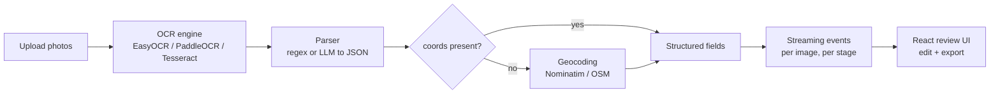

# Folletos OCR — structured field extraction from field-delivery photos

A self-hosted service that turns photos of leaflet/flyer deliveries (taken with a
GPS-camera overlay) into clean, structured records: postal **address**, **postal code**,
**zone**, **date**, and **coordinates** (lat/lon). It combines OCR, an LLM parser, and
geocoding behind a streaming API and a React review UI.

> **About this repository.** This is a public, cleaned-up copy of a project I built at
> **Traycco** together with my business partner, **Gonzalo Finkelstein**. The original
> lives in a private repository (which is why the commit history here starts fresh — this
> copy was prepared to show the work publicly, with no client data or credentials).
>
> Applied ML / ML-engineering: it orchestrates pre-trained models (OCR and an LLM) into a robust, 
> production-grade pipeline — end to end, from ingestion to a reviewable, exportable result.

---

## The problem

Delivery crews photograph each drop with a GPS-camera app that stamps an overlay (address,
date, sometimes coordinates) onto the image. Reading those overlays by hand to build a
verifiable delivery record is slow and error-prone. This service automates it: drop in a
batch of photos, get back a structured, reviewable table of extracted fields, ready to
export.

## What it does

Three quality/speed levels, so the operator trades latency for accuracy per batch:

| Level | OCR engine | Parser | When to use |
|-------|-----------|--------|-------------|
| `rapida` (fast) | EasyOCR | regex | quick pass, lowest cost |
| `media` (medium) | EasyOCR | LLM | better recall on messy overlays |
| `avanzada` (advanced) | PaddleOCR | LLM | hardest images, best quality |

The backend advertises what's actually enabled through `GET /capabilities`, and the
frontend greys out any level whose engine or model isn't available — so the UI never
offers a mode the server can't run.

## Architecture



The pipeline is **staged and streaming**: results for the fast stage of *every* image in a
batch come back before the slow stage starts, so an operator sees preliminary data for the
whole batch quickly while heavier OCR+LLM work continues in the background.

## ML / AI components

- **OCR (computer vision).** Pluggable engines — EasyOCR, PaddleOCR, and Tesseract — behind
  a single `detections_to_text` interface, each returning boxes + text + confidence. Engines
  are lazy-loaded and cached per process.
- **LLM extraction.** A local LLM (served via Ollama, e.g. `qwen2.5:3b`) turns raw, noisy OCR
  text into a strict JSON schema (`adreca`, `cp`, `fecha`, `x_lon`, `y_lat`), with a
  temperature-0, `format=json` prompt designed to never hallucinate missing fields (`null`
  instead of guesses). A regex parser is the deterministic fallback.
- **Geocoding.** When the overlay lacks coordinates, the extracted address is geocoded via
  Nominatim/OpenStreetMap, with rate limiting and a query builder that avoids the common
  failure of double-appending the postal code.

## Engineering highlights

- **Process-pool parallelism with a RAM-aware safety cap.** Each worker loads its own copy of
  the OCR models, so memory grows with workers; `resolve_workers` caps concurrency to
  `min(cores, available_RAM * fraction / per_worker_GB)` to avoid OOM under load.
- **Staged batch processing** (`run_batch`) that keeps phase ordering (all fast stages before
  any final stage) while parallelizing within a stage; failures are isolated per image so one
  bad photo doesn't sink the batch.
- **Streaming API** — per-image, per-stage events — instead of a single blocking response.
- **Capability negotiation** between backend and frontend so the UI reflects the real runtime.
- **Full test suite** across parsing, geocoding, engines, pipeline, and the API routes.
- **One-command deploy**: `docker compose up --build` brings up frontend, API, the LLM
  runtime, and warms the OCR/LLM models so the first request doesn't pay the load cost.
- Careful handling of real-world platform quirks (documented inline): PaddleOCR's oneDNN
  kernel under amd64 emulation, Nominatim's User-Agent policy, and more.

## Tech stack

Python · FastAPI · Pydantic · EasyOCR / PaddleOCR / Tesseract · Ollama (LLM) · geopy /
Nominatim · React · TypeScript · Vite · Docker Compose · Streamlit (optional demo UI).

## Running it

```bash
cp .env.example .env
docker compose up --build
```

That brings up and wires the whole stack:

- **React frontend** → http://localhost:5173
- **API** → http://localhost:8000
- **Ollama (LLM)** with automatic model download
- **Warmup** of the OCR + LLM models at boot (the first request doesn't wait on model load)

> The **first** run downloads Docker images and OCR/LLM models and can take several minutes.
> The frontend only becomes available once the backend passes its healthcheck.
>
> **Platform note:** the backend pins `linux/amd64` because `paddlepaddle` publishes no
> `arm64` wheels. It runs natively on x86; on Apple Silicon it runs under emulation (works,
> but slower).

Optional Streamlit demo: `docker compose --profile demo up` → http://localhost:8501

To reduce memory use, set `ENABLE_PADDLEOCR=0` and/or `ENABLE_LLM=0` in `.env`.

## Tests

```bash
cd backend
pip install -e .
pytest
```

## License

MIT — see `LICENSE`. Domain data (delivery photos) is not included.
